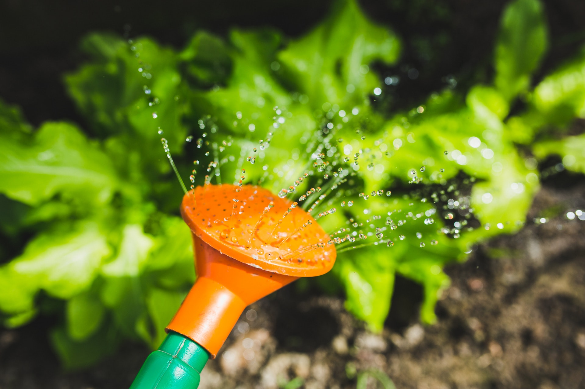
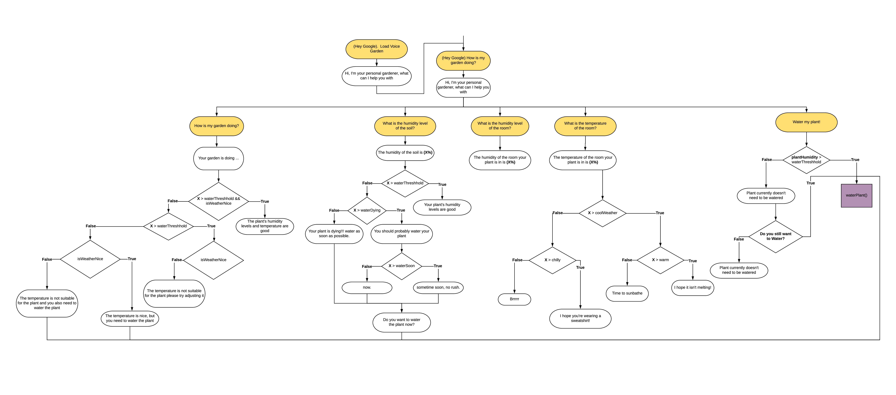

# Voice Garden 

Voice Garden team @[BrickHack 4](https://brickhack.io/). Our team is [Pat](https://github.com/SweetmanTech), [Zach](https://github.com/BronxBombers), [Alex](https://github.com/alex9jk) & [Saleh](https://github.com/qirh).
Development Google Doc is [here](https://docs.google.com/document/d/17A3qvEIXEAEWF4IlBtXKWe8o2696Y7JVG5GbErC8sJk/edit) 

This is a Google Voice application. The application enables the Voice to issue commands and request information from an Arduino ([EcoDuino](https://www.dfrobot.com/product-641.html)). Moreover the Arduino comes equipped with a humidity+temprature sensor and a water pump.

## Conversation Flowchart

## Copyright Information
* Stock image from [here](https://www.pexels.com/photo/watering-plants-with-a-watering-can-6442/). **Credit:** Photo by Kaboompics // Karolina from [Pexels](https://www.pexels.com/photo/watering-plants-with-a-watering-can-6442/)
* Flowcahrt created using [lucidchart](https://www.lucidchart.com)
